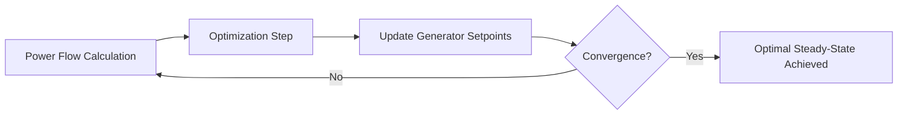

# ⚡ Grid Feedback Optimizer

[]()
[](LICENSE)
<!-- [](https://grid-feedback-optimizer.readthedocs.io/en/latest/) -->

A Python package for **feedback-based optimization** of generator and device setpoints in electrical distribution grids.

---

## 🧩 Overview

**Grid Feedback Optimizer** reads a **JSON/Excel network description** and iteratively computes optimal setpoints.  
Ideal for experimenting with **voltage regulation** and **congestion management**.

📖 Full API Reference: [ReadTheDocs](https://grid-feedback-optimizer.readthedocs.io/en/latest/)

---

## 🔋 RenewGen

`RenewGen` models controllable **generators** and **power-consuming devices**:

| Type | Condition |
|------|-----------|
| Generator | `0 <= p_min <= p_max` |
| Load | `p_min <= p_max <= 0` |
| Flexible | `p_min < 0 < p_max` (can generate or consume) |

**Key Attributes:**

- `index`, `bus` – identifiers  
- `p_max`, `p_min` – active power limits   
- `p_norm` – normal active power (auto-computed if not provided)  
- `q_norm` – normal reactive power (default: `0.0`)  
- `c1_p`, `c2_p` – linear/quadratic active power cost coefficients (defaults: `0.0`, `1.0`) 
- `c1_q`, `c2_q` – linear/quadratic reactive power cost coefficients (defaults: `0.0`, `0.1`) 
- `s_inv` – apparent power rating (*optional*)
- `pf_min` - minimum power factor (*optional*)
- `q_max`, `q_min` – reactive power limits (*optional*)

**Cost Function:**


Cost = c1_p * p + c2_p * (p - p_norm)^2 + c1_q * q + c2_q * (q - q_norm)^2

Automatic `p_norm`:

- Generator → `p_norm = p_max`  
- Load → `p_norm = p_min`  
- Flexible → `p_norm = 0.0`  

---

## 🚀 Features

- Load networks from **JSON/Excel** files  
- Iterative feedback optimization using:
  - **Gradient Projection (GP)** – fewer hyperparameters, convex conic problem solver  
  - **Primal-Dual (PD)** – lightweight, more hyperparameters  
- Structured input/output data  
- Modular design (`models`, `engine`, `utils`) for extensions  

---

## 🏃 Quick Start

**Install:**

```bash
pip install grid-feedback-optimizer
```

**Example Notebooks**:  

- Load sample grid models  
- Run optimization with GP or PD  
- Visualize voltages, line loadings, and setpoints  
- Time-series simulations  

Folders:  
- `examples/` → JSON/Excel network files  
- `notebooks/` → example notebooks  

---

## 🧑‍💻 Usage Example

```python
from grid_feedback_optimizer.models.loader import load_network
from grid_feedback_optimizer.engine.solve import solve
from grid_feedback_optimizer.engine.powerflow import PowerFlowSolver

network = load_network("../examples/simple_example_with_transformer.json")
power_flow_solver = PowerFlowSolver(network)
print(power_flow_solver.is_congested)

res_gp = solve(network, algorithm="gp")
res_gp.print_summary()
res_gp.plot_iterations()
res_gp.save("gp_result.json")
```

---

## 🐳 Docker

```bash
docker pull senzhan2025/grid-feedback-optimizer:latest
docker run --rm -v $(pwd)/output:/app/output senzhan2025/grid-feedback-optimizer:latest examples/simple_example.json --save_path output/result.json --verbose
```

---

## 🔄 Conceptual Workflow



1. **Power flow calculation** → voltages, line/transformer loadings  
2. **Optimization step** → update generator active/reactive power using feedback  
3. **Iteration** → until convergence  

---

## 📚 References

- Gradient Projection – V. Haberle et al., *IEEE Control Systems Letters*, 2021. [DOI](https://doi.org/10.1109/LCSYS.2020.3002152)  
- Primal-Dual – E. Dall’Anese & A. Simonetto, *IEEE Transactions on Smart Grid*, 2018. [DOI](https://doi.org/10.1109/TSG.2016.2571982)

---

## ⚠️ Limitations

- Currently supports **balanced systems** only  
- Currently only includes **buses, lines, transformers, and sources** as defined in [power-grid-model](https://power-grid-model.readthedocs.io/en/stable/user_manual/components.html)  
- Restricted to single-period (real-time) optimization

---

## 📄 License

[MIT License](LICENSE)  

---

## 👤 Author

**Sen Zhan**  
📧 [sen.zhan@outlook.com](mailto:sen.zhan@outlook.com)
